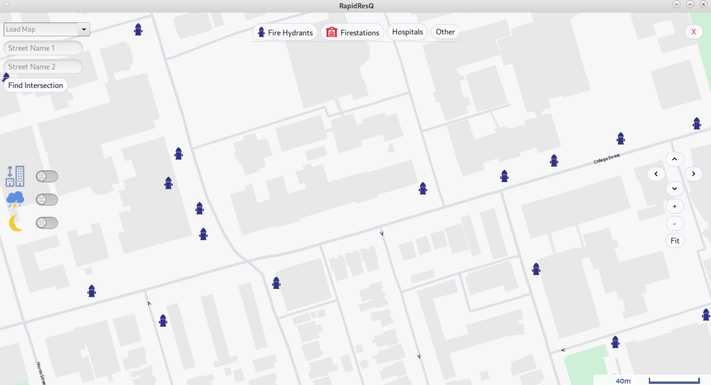
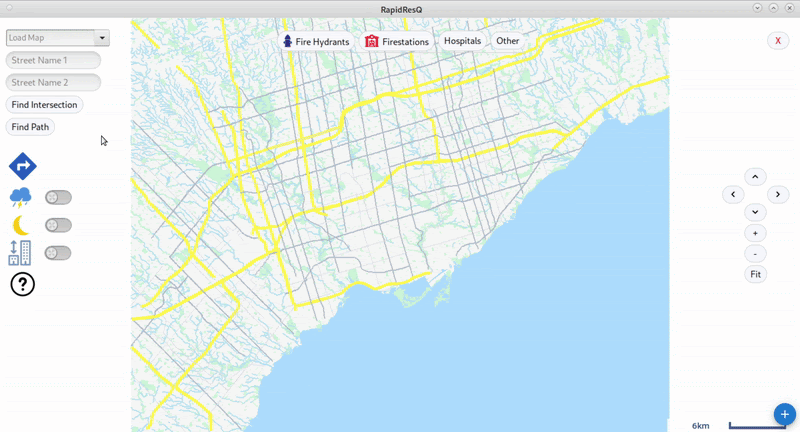
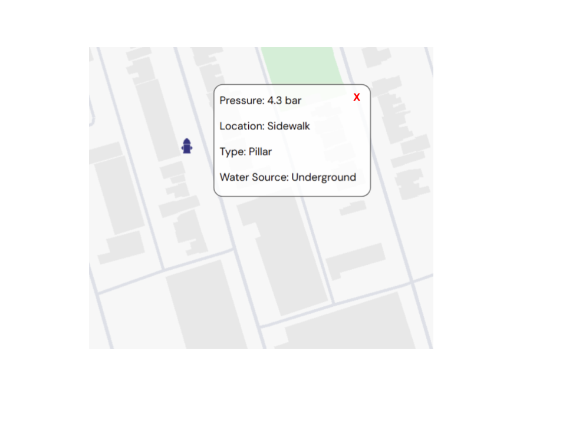

# RapidResQ 🚒🔥
Firefighter-focused GIS mapping app (ECE297, UofT) with hydrant/building/weather layers, night mode, A routing, and optimization. Our courier/TSP solution outperformed the TA's best benchmark. Docs only; code not included.

> **Note**: This repository documents the project only. **Source code is not included** per course policy.

## Overview
RapidResQ is an emergency response tool that gives firefighters **fast, clear, and reliable** access to the information they need under pressure. Built for **ECE297 (Software Design & Communication, University of Toronto)**, it combines a **usability-first map UI** with **routing and optimization algorithms** to support split‑second decisions.

Our mission: **help first responders prepare, act, and respond with confidence.**

---

## Features
### 🔑 Usability & UI
- **Layer Toggles**: Quickly show/hide weather, hydrants, and building heights.
- **Night Mode**: Improves readability in low light and while driving.
- **High-Contrast Icons & Colours**: Distinguish hydrants, POIs, and building layers at a glance.
- **Dynamic Level of Detail (LOD)**: Zoom-based rendering (highways → hydrants) cuts visual clutter.
- **Scale Bar & Legends**: Better spatial awareness for pre‑planning.

### 🚰 Critical Data Layers
- **Fire Hydrants**: Locations with details (pressure, type, water source).
- **Buildings**: Heights and material context for vertical access planning.
- **Weather**: Contextual data for attack strategy (wind, precipitation, etc.).

### 🧭 Smart Navigation
- **Autocomplete Search**: Real-time suggestions for addresses/streets.
- **A* Pathfinding**: Fast, optimal routing tuned for emergency response.

### ⚡ Optimization
- **Ant Colony Optimization (ACO)**: Generates strong initial routes.
- **2‑Opt & Or‑Opt**: Local refinements to decrease overall travel time.
- **Multithreading**: Improves responsiveness under heavier loads.
- **Render Efficiency**: **25–50%** reduced render times; typical frame under **100 ms**.
- **TSP Success**: Our courier routing solution (Travelling Salesman Problem) achieved a **lower QoR than the TA's best benchmark**, demonstrating the effectiveness of our optimization approach.

---

## Technical Highlights
- **Language**: C++ (course framework)
- **Pathfinding & Optimization**: A*, Ant Colony, 2‑Opt, Or‑Opt
- **Rendering**: Dynamic, zoom-aware selective rendering
- **UX Validation**: Survey, button-driven layer control, night mode

---

## Demo Highlights  

<!-- Demo Highlights (HTML table for consistent sizing) -->
<table style="width:100%; table-layout:fixed;">
  <thead>
    <tr>
      <th style="text-align:center; padding:8px;">Autocomplete + Routing</th>
      <th style="text-align:center; padding:8px;">Dynamic Level of Detail</th>
    </tr>
  </thead>
  <tbody>
    <tr>
      <td style="width:50%; padding:8px;">
        
      </td>
      <td style="width:50%; padding:8px;">
        
      </td>
    </tr>
    <tr>
      <th style="text-align:center; padding:8px;">Hydrant Info</th>
      <th style="text-align:center; padding:8px;">Night Mode</th>
    </tr>
    <tr>
      <td style="padding:8px;">
        
      </td>
      <td style="padding:8px;">
        
      </td>
    </tr>
    <tr>
      <th style="text-align:center; padding:8px;">Building Heights</th>
      <th style="text-align:center; padding:8px;">Weather Layer</th>
    </tr>
    <tr>
      <td style="padding:8px;">
        
      </td>
      <td style="padding:8px;">
        
      </td>
    </tr>
    <tr>
      <th style="text-align:center; padding:8px;">Pathfinding Example</th>
      <th style="text-align:center; padding:8px;">Hydrant Detail Popup</th>
    </tr>
    <tr>
      <td style="padding:8px;">
        
      </td>
      <td style="padding:8px;">
        
      </td>
    </tr>
  </tbody>
</table>

---

## Performance & Usability
- **Render time**: 25–50% reduction vs. baseline; typical frame < 100 ms. 
- **Optimization**: Courier/TSP routing beat the TA best solution, confirming algorithmic efficiency.
- **Clarity-first design**: Buttons, legends, and high-contrast colour choices.

---

## Team
**Kishan**, **Sahib**, **Davina**  
University of Toronto — **ECE297: Software Design & Communication**

---

## Acknowledgements
- Course staff for framework and datasets
- External references on usability, response times, and fire modelling

---

## License
This repository contains **documentation and media only**. No source code is distributed.
Unless otherwise noted, text and images © the authors. For educational use.
